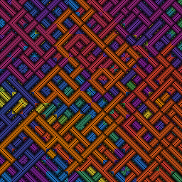

# kirina

## Usage

```
go run main.go
	<generators-options>
	<general-options>
	<optional-out-png-filename>
```

## General options

```
	--width <int> : width of the output
	--height <int> : height of the output
	--seed <int> : number of the seed to use
	--bg <string> : background color to use ("black" by default, "white" accepted)
	-v : enable OpenGL visualization of image building (slow computation)
```

## Generators options

### Common options

```
	--p1 <int> : value of generator first parameter
	--p2 <int> : value of generator second parameter
	--p3 <int> : value of generator third parameter
	--colors <string> : name of colors to use (see Color packs)
	--cycles <int> : number of cycles of generator to do
```

### Color packs

- `trisummer`
- `green`
- `rainbow`
- `beach`
- `synthwave`
- `grey`

### Simple generators

#### BasicDiagonalLine (bdl)

<p align="center"></p><br/>

`go run main.go -bdl --p1 <space_int> --colors <colors_name>`

##### Bi-symetry version with :

`go run main.go -bdl2 --p1 <space_int> --p2 <sym_type> --colors <colors_name>`

Replace <sym_type> by 0 for horizontal, 1 for vertical and 2 for diagonal.

##### Quad-symetry version with :

`go run main.go -bdl4 --p1 <space_int> --colors <colors_name>`

##### Inversed line version

<p align="center"></p><br/>

Run previous commands and replace `-bdl` by `-ibdl`, `-bdl2` by `-ibdl2` or `-bdl4` by `-ibdl4`.

#### BasicDiamondGrid (bdg)

<p align="center"></p><br/>

`go run main.go -bdg --p1 <space_int> --colors <colors_name>`

#### BasicPointPerPoint (bppp)

<p align="center"></p><br/>

`go run main.go -bppp --p1 <space_int> --colors <colors_name>`

### Complex generators

#### Turning hazardous shape (ths)

<p align="center"></p><br/>

`go run main.go -ths --p1 <sand_int> --colors <colors_name>`

You can add `--p2 1` to enable a "blur".
